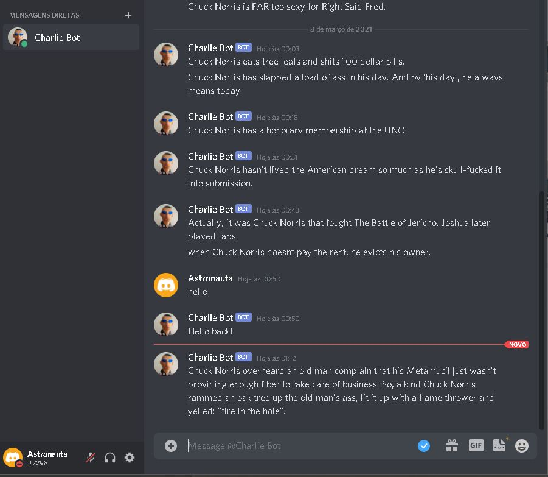

# Charlie-The-Bot
A simple Discord bot written in Python<br>
The bot will send you a random Chuck Norris quote every time you join the channel.<br>
More functions will be implemented soon<br>



## Instalation
Download Charlie The Bot
```
git clone https://github.com/solariscodes/Charlie-The-Bot.git
```
Install dependencies
```
pip install discord
pip install os
pip install json
pip install requests
pip install logging
```
Set up your TOKEN
```sh
export TOKEN=yourtokencode
```
